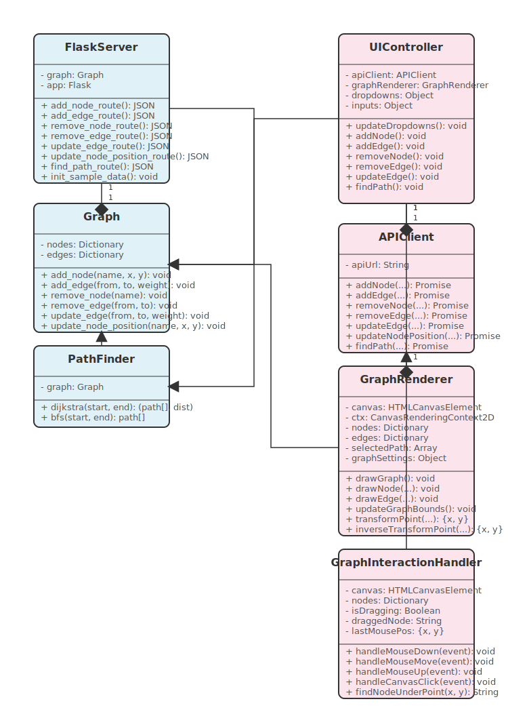

# 🚚 Route Planning System 

## 📋 Overview

The Route Planning System is a powerful tool designed for **Speedy Deliveries Inc.** to optimize local delivery routes by modeling locations as a graph and finding the most efficient paths between them. This application provides an intuitive visual interface for route management and pathfinding algorithms.



## ✨ Key Features

- **📊 Graph Visualization**: Interactive and dynamic visualization of delivery locations as a weighted graph
- **📍 Location Management**: Add, remove, and drag locations on an interactive canvas
- **🛣️ Route Management**: Create, update, and remove routes between locations with custom distances
- **🔍 Pathfinding Algorithms**: 
  - **Dijkstra's Algorithm**: Find the shortest weighted path between locations
  - **Breadth-First Search (BFS)**: Find the path with the fewest stops between locations
- **📱 Responsive UI**: Clean, modern interface with educational information about algorithms

## 🔧 Technical Implementation

- **Frontend**: Pure JavaScript, HTML5 Canvas for visualization
- **Backend**: Flask Python API with RESTful endpoints
- **Data Structure**: Graph representation with adjacency lists
- **Algorithms**: Dijkstra's (for weighted paths) and BFS (for unweighted paths)

## 📋 Requirements

- **Python**: 3.7 or higher
- **Dependencies**: Flask, Flask-CORS
- **Browser**: Modern web browser with HTML5 support (Chrome, Firefox, Edge, Safari)

## 🛠️ Installation

1. **Clone the repository**:
   ```bash
   git clone https://github.com/your-username/route-planning-system.git
   cd route-planning-system
   ```

2. **Set up a virtual environment** (recommended):
   ```bash
   # Windows
   python -m venv venv
   venv\Scripts\activate

   # macOS/Linux
   python -m venv venv
   source venv/bin/activate
   ```

3. **Install dependencies**:
   ```bash
   pip install -r requirements.txt
   ```

## 🚀 Running the Application

1. **Start the backend server**:
   ```bash
   python app.py
   ```
   This will launch the Flask server on `http://localhost:5000`

2. **Open the frontend**:
   - Simply open `index.html` in your web browser
   - You can double-click the file or use File > Open in your browser

## 💻 Using the Application

### Adding Locations

1. **Enter location details**:
   - Name (e.g., "A", "Warehouse", "Downtown")
   - X and Y coordinates (or click directly on the canvas to set coordinates)
2. Click **"Add Location"**

### Creating Routes

1. **Select the start and end locations** from the dropdowns
2. **Enter the distance** between them
3. Click **"Add Route"**

### Finding Optimal Paths

1. **Select start and destination** locations
2. **Choose algorithm**:
   - **Dijkstra's Algorithm**: For finding the shortest total distance
   - **BFS**: For finding the path with fewest stops
3. Click **"Find Path"**
4. View the highlighted path on the graph and detailed results

### Advanced Operations

- **Drag Locations**: Click and drag any location to reposition it
- **Update Routes**: Select two connected locations and enter a new distance
- **Remove Elements**: Delete locations or routes as needed
- **Learn About Algorithms**: Click the info buttons to learn about each algorithm

## 🌟 Interactive Features

- **Dynamic Graph Scaling**: The graph automatically scales to fit the canvas
- **Node Dragging**: Reposition locations by dragging them
- **Visual Feedback**: Selected paths are highlighted in red
- **Educational Content**: Modal dialogs explaining algorithms in detail

## 📊 Sample Data

The application comes pre-loaded with a sample graph of 5 locations (A, B, C, D, E) with various connections between them to demonstrate functionality.

## 🧩 How It Works

### Backend Architecture

The Flask backend provides RESTful API endpoints for:
- Graph operations (add/remove/update nodes and edges)
- Pathfinding algorithms (Dijkstra's and BFS)
- In-memory graph storage

### Algorithms Implementation

#### Dijkstra's Algorithm
- Uses a priority queue for efficient node selection
- Maintains distance and previous node tracking
- Returns the shortest path and total distance

#### Breadth-First Search
- Uses a queue to explore nodes level by level
- Ideal for finding paths with minimal hops
- Returns the path with fewest intermediate stops

## 🔍 Troubleshooting

- **Server Connection Issues**: Ensure the Flask server is running on port 5000
- **Graph Not Visible**: Check if your browser supports HTML5 Canvas
- **Paths Not Found**: Verify that a valid path exists between selected locations

## 🤝 Contributing

Contributions to enhance the Route Planning System are welcome! Feel free to:
- Add new algorithms
- Improve the visualization
- Enhance the user interface
- Optimize existing code

## 📄 License

This project is available for educational and commercial use.

---

Made with ❤️ for Speedy Deliveries Inc. 